<div align="center">


<a href="https://github.com/stucaluc">
  
</a>

<br/>


<br/><br/>

<a href="https://www.linkedin.com/in/daniel-stucaluc-devweb-ti/">
  
</a>
<a href="mailto:stucalucsystems@gmail.com">
  
</a>
<a href="https://github.com/stucaluc">
  
</a>

<br/><br/>


</div>

---

## 🧑‍💻 About

```text
Full Stack Developer focused on building scalable web systems, RESTful APIs
and intelligent process automation.
```

- 🔭 **Full Stack Developer** — web systems, e-commerces, corporate portals and management applications, from scope definition to delivery and post-deployment support
- 🤖 **RPA & Automation** — automation bots integrating legacy systems with modern platforms, eliminating manual rework in administrative and financial processes
- 🎓 **B.Sc. Computer Science** (Universidade Brás Cubas) + **Cyber Defense Technologist** (FIAP)
- 🧠 **Product engineering mindset** — requirements gathering with stakeholders, translating business needs into technical solutions
- 🌱 Deep diving into **AI agents, intelligent workflows and cybersecurity**

> **Open To:** Full Stack opportunities · Freelance projects · Automation & RPA consulting · Open Source collaboration

---

## 🛠️ Tech Stack

<div align="center">

### Languages


### Frontend


### Backend & Databases


### Mobile

&nbsp;

### Cloud, DevOps & Tooling


</div>

---

## 🤖 Automation & AI

<div align="center">

| Domain | Proficiency | Details |
|:---|:---:|:---|
| **RPA / Process Automation** | ████████░░ | Automation bots for administrative & financial workflows, legacy system integration |
| **API Integration** | ████████░░ | RESTful APIs, payment gateways, third-party service orchestration |
| **AI-Assisted Development** | ███████░░░ | AI-powered productivity workflows, intelligent agents for software development |
| **Cybersecurity** | █████░░░░░ | Cyber Defense degree in progress @ FIAP — network defense, secure development |

</div>

---

## 🚀 Featured Projects

<details>
<summary><b>🐾 PetShop Management Platform</b></summary>

<br/>

Full management platform for a pet shop business — cash flow control, appointment scheduling, inventory management and operational modules.

| | |
|:---|:---|
| **Stack** | PHP · JavaScript · MySQL · Bootstrap · REST API |
| **Scale** | Multi-module system: POS, scheduling, inventory, reporting |
| **Performance** | Responsive interfaces optimized for daily operational use |
| **Security** | Authentication, role-based access, input validation |
| **Impact** | Centralized business operations previously managed manually |
| **Repository** | 🔒 Private — client project |

End-to-end ownership: requirements gathering with the client, data modeling, API design, frontend implementation and post-deployment support.

</details>

<details>
<summary><b>💆 Physiotherapy Landing Page</b></summary>

<br/>

High-conversion landing page for a microphysiotherapy professional — focused on lead generation, mobile-first design and performance.

| | |
|:---|:---|
| **Stack** | HTML5 · CSS3 · JavaScript · Bootstrap |
| **Scale** | Single-page application with conversion-oriented sections |
| **Performance** | Lightweight, fast-loading, mobile-first |
| **Security** | Form validation and protected contact flow |
| **Impact** | Professional digital presence and direct client acquisition channel |
| **Repository** | 🔒 Private — client project |

Conversion-focused structure: hero section, social proof, services showcase and clear CTAs.

</details>

---

## 💼 Experience

### 🤖 Automation Developer (RPA)
**Robotizei Tecnologia** · May 2023 – Nov 2024

- Developed RPA automations for administrative and financial processes, reducing manual rework and increasing operational efficiency
- Built automation bots integrating legacy systems with modern platforms
- Developed internal systems focused on usability and scalability
- Gathered requirements with stakeholders and translated business needs into technical solutions
- Collaborated with multidisciplinary teams to implement and maintain automated pipelines

`RPA` `Process Automation` `System Integration` `Requirements Engineering`

### 💻 Full Stack Developer
**Freelancer (Self-employed)** · Jan 2025 – Present

- On-demand web systems: e-commerces, corporate portals and management applications
- Design and maintenance of RESTful APIs, external service integrations and payment gateways
- Relational and non-relational database management (MySQL, PostgreSQL, MongoDB)
- Responsive interfaces with HTML, CSS and JavaScript, prioritizing performance and accessibility
- Full project lifecycle: scope definition → delivery → post-deployment support

`PHP` `JavaScript` `MySQL` `PostgreSQL` `MongoDB` `REST APIs` `Bootstrap`

---

## 📊 GitHub Analytics

<div align="center">


<br/><br/>


</div>

---

## 📈 Contribution Activity

<div align="center">



</div>

---

## 🐍 Contribution Snake

<div align="center">


</div>

---

## 🎯 Current Focus

```yaml
learning:
  - Cyber Defense & Network Security (FIAP)
  - Advanced Computer Science fundamentals
  - AI Agents & intelligent workflows

building:
  - PetShop management platform (evolution & new modules)
  - Personal portfolio website
  - Knowledge base & second brain system

exploring:
  - AI applied to software development & productivity
  - Homelab, servers & infrastructure
  - Process automation at scale

open_to:
  - Full Stack opportunities
  - Freelance & consulting projects
  - Open Source collaboration
```

---

## 🤝 Connect

<div align="center">

<a href="mailto:stucalucsystems@gmail.com">
  
</a>
<br/>
<a href="https://www.linkedin.com/in/daniel-stucaluc-devweb-ti/">
  
</a>
<br/>
<a href="https://github.com/stucaluc">
  
</a>

</div>

---

<div align="center">

*"Building systems that work while you sleep — automation is the highest form of efficiency."*


</div>
